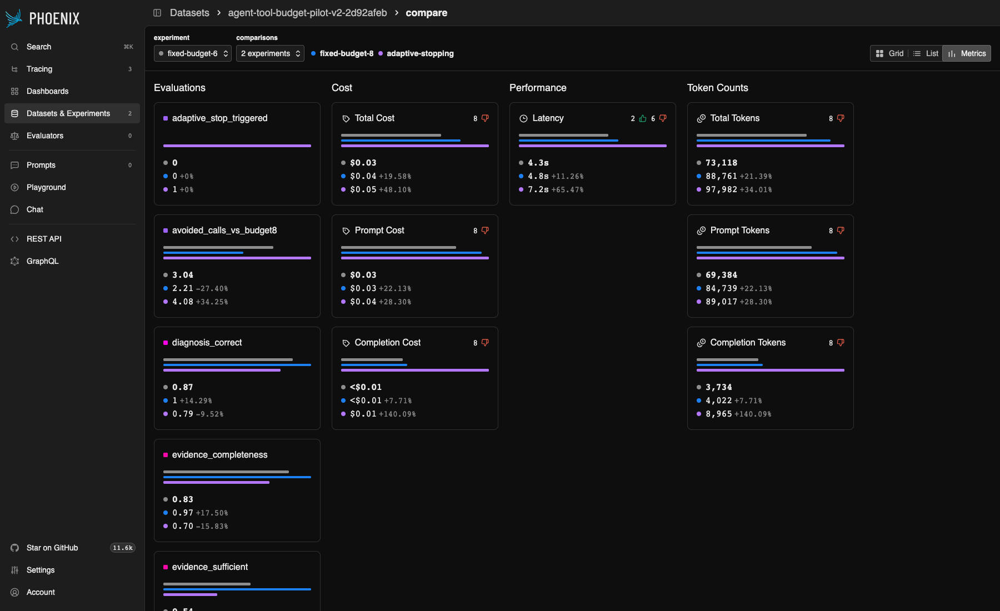

# Agent Tool-Budget Lab

How does an AI agent's tool-call budget affect reliability, evidence gathering,
and efficiency—and can an adaptive stopping controller improve that tradeoff?
This project uses Microsoft Agent Framework for the agent loop and tool budget,
Arize Phoenix for tracing, datasets, experiments, and evaluations, and a
deterministic synthetic diagnostic environment. Its negative adaptive-stopping
result shows why a controller's cost and failure modes must be measured alongside
those of the agent it controls.

**Headline finding:** Fixed-8 achieved the highest reliability in this workload.
The adaptive controller used fewer tools but was slower, more token-expensive,
and less accurate.

## Why this project

Agent frameworks expose execution-budget controls, but choosing a limit changes
what an agent can learn. A small budget can force an answer before enough evidence
is gathered; a larger one can allow unnecessary investigation. Final-answer
accuracy alone misses those differences, so Phoenix was used to inspect the
sequence of model requests, tool calls, evidence collection, and stopping decisions.

## System design

The environment has four components: `frontend`, `api`, `database`, and `cache`.
Three tools expose their state:

- `check_status(component)`
- `read_logs(component)`
- `check_recent_change(component)`

The [eight scenarios](data/scenarios.json) define known root causes, required
evidence, optional supporting evidence, and distractors. Evaluation fields are
hidden from the runtime agent and stopping controller. Each run starts with a
fresh world; tools return deterministic observations with stable evidence IDs.

Synthetic incidents provide reproducible inputs, objective ground truth,
controlled difficulty, and deterministic scoring. They remove variability from
external diagnostic services; model decisions and live inference latency can
still vary.

```text
User report → Microsoft Agent Framework → Diagnostic tools → Synthetic environment
                       │                       │
                       └── model/tool spans ───┘
                                  ↓
                             Arize Phoenix
                    traces · dataset · evals · experiments
```

## Experiment 1: Fixed tool budgets

The independent variable was maximum tool/function calls: **2 / 4 / 6 / 8**.
The Phoenix sweep ran each scenario once at each budget, for 32 runs.

Everything else stayed fixed: `gpt-4.1-mini-2025-04-14`, temperature 0, system
prompt, tools, scenarios, structured diagnosis schema, and framework configuration.
Parallel tool calls were disabled. An exact execution guard supplements the
framework limit because a batch can otherwise overshoot the cap.

| Tool budget | Accuracy | Evidence completeness | Avg. calls | Premature stops |
|---|---:|---:|---:|---:|
| 2 | 50.0% | 25.0% | 1.88 | 87.5% |
| 4 | 62.5% | 64.6% | 3.75 | 62.5% |
| 6 | 87.5% | 82.3% | 5.13 | 50.0% |
| 8 | 100% | 96.9% | 5.75 | 12.5% |

Higher budgets substantially improved accuracy and evidence collection in this
controlled workload. Eight was the best observed fixed-budget configuration in
this experiment. These are [verified Phoenix results](PHOENIX_TRACE_FINDINGS.md)
under the [reviewed rubric](data/RUBRIC_CHANGES.md); the original pilot's earlier
scores are preserved separately in [PILOT_REPORT.md](PILOT_REPORT.md).

## What Phoenix revealed

Ordered model/tool spans exposed what each tool returned, which evidence remained
missing, and whether the agent answered voluntarily or was forced to stop by its
budget. Traces distinguished correct guesses from supported diagnoses and showed
calls made after sufficient evidence was already available.

A targeted repeatability study ran all three medium and both hard scenarios at
budgets 6 and 8, five times per cell: **50 runs**. Diagnoses stayed stable within
all **10 scenario/budget groups**, but **6 of 10** had varying tool trajectories.

**Outcome stability can hide trajectory instability.** The same diagnosis can
come from different evidence paths, call counts, latency, token usage, and stopping
behavior. The [trajectory report](TRAJECTORY_VARIATION.md) documents those
variations. It found no post-sufficiency calls in the medium/hard subset; the
recurring opportunity to stop sooner was concentrated in earlier easy-case traces.

## Experiment 2: Adaptive stopping

The hypothesis was that a model-based controller could inspect observed evidence
after each tool result and return structured `STOP` or `CONTINUE` decisions.
The same model snapshot served as the controller, with a hard ceiling of eight
diagnostic tool calls.

The controller received only the user report and observed tool names, arguments,
outputs, and evidence IDs. It could not see the root cause, required/supporting
evidence labels, distractor labels, difficulty, or evaluation metadata. Every
check was traced in Phoenix. The [prompt and success criteria](ADAPTIVE_HYPOTHESIS.md)
were frozen before the final comparison and were not tuned afterward.

The final experiments—`fixed-budget-6`, `fixed-budget-8`, and
`adaptive-stopping`—used the same eight-example dataset with three repetitions
per configuration: **72 runs**. These are separate repeated measurements from
Experiment 1, so their averages differ.

| Metric | Fixed-6 | Fixed-8 | Adaptive |
|---|---:|---:|---:|
| Accuracy | 87.5% | 100% | 79.2% |
| Evidence completeness | 83.3% | 97.9% | 70.1% |
| Evidence sufficiency | 54.2% | 91.7% | 33.3% |
| Avg. tool calls | 4.96 | 5.79 | 3.92 |
| Total tokens/run | 3,047 | 3,698 | 4,083 |
| Seconds/run | 4.31 | 4.85 | 7.20 |

Compared with fixed-8, adaptive stopping reduced tool use by **32.4%**, but used
**10.4% more total tokens** and took **48.7% more time**. Accuracy fell to **79.2%**;
**16 of 24 adaptive runs stopped without sufficient evidence**. Token and latency
figures include controller overhead.

The hypothesis was not supported. The controller sometimes accepted a plausible
intermediate explanation before resolving the underlying cause. For example, it
stopped after observing slow API reads, before checking database health and cache
evidence, and the diagnostic agent attributed the incident to the wrong cause.
See [the complete comparison and failure traces](ADAPTIVE_RESULTS.md).

## Main developer learnings

- Tool-call budgets materially affect agent reliability on this workload.
- Correct final answers can still have incomplete evidential support.
- Stable final outputs do not imply stable tool trajectories.
- Fewer diagnostic calls do not necessarily reduce total inference cost.
- A controller adds latency, tokens, and its own failure modes.
- Evaluate adaptive stopping as part of the complete system.

## Why Phoenix mattered

Python scoring supplied the metrics; Phoenix connected those scores to the
execution that produced them. Experiments shared a dataset and deterministic
evaluations, while individual traces exposed evidence collection step by step,
forced versus voluntary stops, and each adaptive decision with its observed input.
That made it possible to explain the controller's failures and account for its
additional model calls.

The working **Metrics**, **List**, and trace views support comparison and diagnosis.
[Integration notes](ADAPTIVE_DESIGN.md#phoenix-trace-page-workaround) document the
local server's annotation workaround; experiment evaluations were preserved.



## Evaluation design

Objective ground truth supports deterministic Python evaluators. **No LLM-as-a-judge
was used for the core metrics**; the stopping model was an online controller.

| Metric | Definition |
|---|---|
| Diagnosis correctness | Canonical or explicitly accepted scenario-specific label |
| Evidence completeness / sufficiency | Fraction of required IDs retrieved / all required IDs retrieved |
| Premature stop | Run ended with incomplete required evidence |
| Tool calls used | Executed attempts, including invalid or repeated attempts |
| Irrelevant calls | Evidence outside the required/supporting rubric |
| Post-sufficiency calls | Calls after the required set was complete |
| Identical repeated calls | Repeated tool/component pair |
| Latency / token usage | Agent execution time and reported model usage |
| Adaptive metadata | Effective STOP, stopping index, false early stop, controller overhead, total tokens |

Correctness and sufficiency remain separate. Missing checklist evidence does not
prove a diagnosis was impossible; exploratory calls may have value even when
classified as irrelevant. False early stops are evaluated **after execution**
using hidden labels. [Full evaluator definitions](ADAPTIVE_DESIGN.md#metric-definitions)
explain the accounting and denominators.

## Repository structure

```text
src/agent_tool_budget_lab/  Agent, environment, tools, stopper, tracing, evaluators
scripts/                   Run experiments and analyze/export results
data/                      Scenarios, evidence rubric, documented corrections
results/                   Reviewed outputs, trace exports, screenshots, checksums
tests/                     Offline tests using scripted model responses
PHOENIX_TRACE_FINDINGS.md   Fixed-budget trace analysis
TRAJECTORY_VARIATION.md     Targeted repeatability study
ADAPTIVE_HYPOTHESIS.md      Frozen policy and acceptance criteria
ADAPTIVE_RESULTS.md         Final comparison and failure analysis
REPRODUCIBILITY.md          Detailed setup and measurement controls
```

## Reproducing the project

**Review the included results without rerunning models.** For intentional live
reproduction, use a separate checkout: Phase 3 writes to the archived result paths.
Commands below incur API usage when they run agents or experiments.

```bash
git clone https://github.com/meganm2c/agent-stopping-lab.git
cd agent-stopping-lab
python3.12 -m venv .venv
.venv/bin/python -m pip install -r requirements-agent-lock.txt
.venv/bin/python -m pip install --no-deps -e .
cp .env.example .env  # only if .env does not already exist
```

Set `OPENAI_API_KEY` privately in `.env`, plus:

```dotenv
MODEL_PROVIDER=openai
MODEL_NAME=gpt-4.1-mini-2025-04-14
MODEL_TEMPERATURE=0
```

Keep `.env` ignored and never commit it. Start Phoenix in a separate terminal:

```bash
python3.12 -m venv .phoenix-venv
.phoenix-venv/bin/python -m pip install -r requirements-phoenix-lock.txt
bash scripts/start_phoenix.sh
```

Open `http://localhost:6006`. Local Phoenix state under `.phoenix/` is not version
controlled. Back in the project terminal:

```bash
# Offline tests; no API credentials needed
.venv/bin/python -m pytest -q

# One diagnostic run, then an easy/hard Phoenix trace check
.venv/bin/python scripts/run_agent.py --scenario diag_001 --max-tool-calls 2
.venv/bin/python scripts/run_phoenix_gate.py

# Fixed-budget Phoenix dataset and experiments
.venv/bin/python scripts/run_phoenix_experiments.py

# Phase 3: targeted repeatability, then fixed-6/fixed-8/adaptive comparison
.venv/bin/python scripts/run_phase3.py variation
.venv/bin/python scripts/run_phase3.py comparison
```

**Phase 3 prerequisite:** its runner checks the original dataset ID/version and
hashes from the archived Phase 2 manifest. Fresh Phoenix servers start empty;
create the Phase 2 dataset first and verify IDs match. Historical IDs and trace
URLs are local to the original server. See [REPRODUCIBILITY.md](REPRODUCIBILITY.md)
for this limitation, dependency snapshots, Azure configuration, exact framework
controls, and [PHOENIX.md](PHOENIX.md) for analysis commands.

## Results and reports

- [Original pilot](PILOT_REPORT.md) — historical rubric and initial measurements
- [Phoenix setup](PHOENIX.md) and [trace findings](PHOENIX_TRACE_FINDINGS.md)
- [Trajectory variation](TRAJECTORY_VARIATION.md) — repeated scenario/budget groups
- [Adaptive hypothesis](ADAPTIVE_HYPOTHESIS.md) — frozen prompt and success criteria
- [Adaptive design](ADAPTIVE_DESIGN.md) — implementation, schema, tracing, evaluators
- [Adaptive results](ADAPTIVE_RESULTS.md) — full metrics and four representative traces
- [Reproducibility](REPRODUCIBILITY.md) and [archived artifacts](results/README.md)

## Limitations

The dataset is small and synthetic, uses one primary model snapshot, and covers a
narrow diagnostic tool environment. Findings are workload-specific and establish
no universal best tool budget. Repeated runs are not independent incident types;
serial experiment order and live API variation affect latency. The adaptive
controller was intentionally not tuned after observing final results.

## Future work

Improve how the controller represents unresolved uncertainty, then test reliability
on larger, more diverse scenario sets and other frameworks/models. Cheaper
controllers, learned decision models, or System-1 models become useful cost-reduction
experiments only after stopping-signal quality improves. This result does not yet
justify adding Laya.
